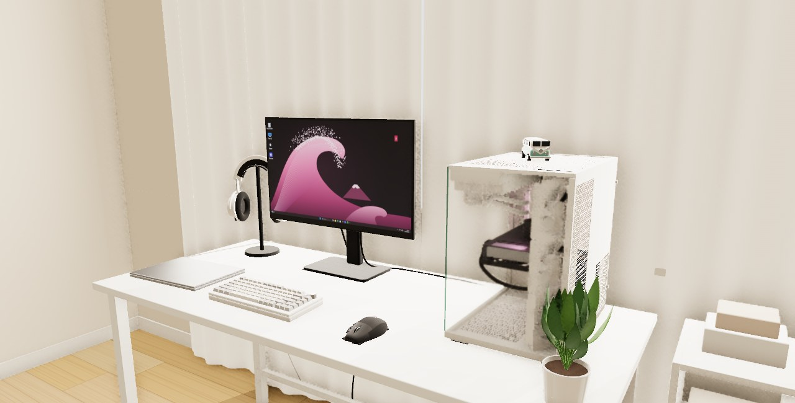
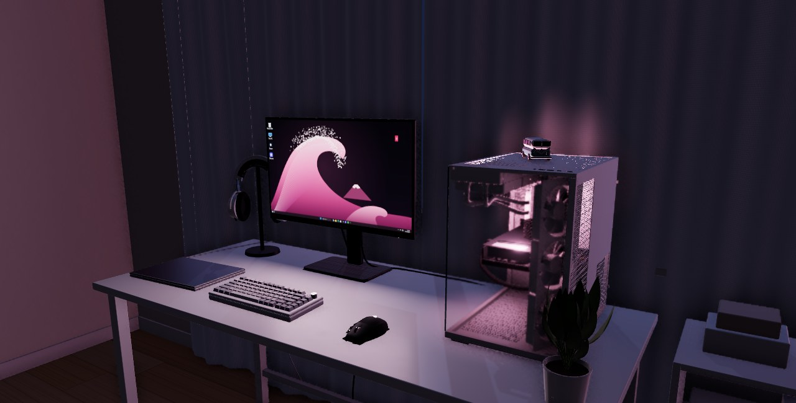
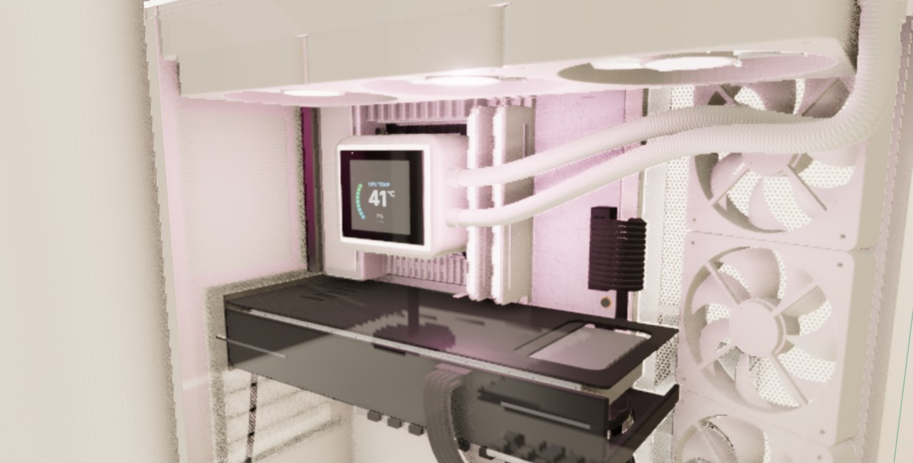
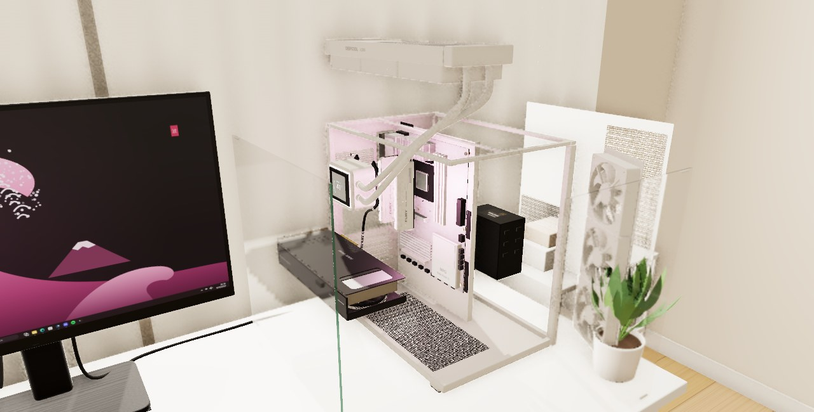

# PC Setup — Interactive 3D Recreation

A real-time 3D recreation of a white PC workspace that runs in the browser: an NZXT H6 Flow build with a Ryzen 5 7500F and RX 9060 XT, a Xiaomi G Pro 27i monitor, an AULA F75 Max keyboard, and a Logitech G502. It is built with Three.js r186 and WebGL 2, using physically based materials. There is also an optional progressive path tracer.

| Day | Night |
|---|---|
|  |  |
|  |  |

## Run it

ES modules need to be served over HTTP. Opening `index.html` directly from disk won't work.

```bash
cd pc-setup
node serve.mjs            # zero-dependency static server → http://localhost:8080
# or: python3 -m http.server 8080
```

Then open <http://localhost:8080> in a current Chromium-based browser or Firefox. Hardware acceleration must be on. All libraries are vendored under `vendor/`, so it needs no internet connection and has no npm install or build step.

## Controls

| Mode | Input |
|---|---|
| **Orbit** (default) | Left-drag rotate · right-drag pan · wheel zoom (damped; the camera can't leave the room) |
| **Free camera** | Click the scene to capture the mouse · **WASD** move · **Shift** fast · **Space** up · **Ctrl** (or **C**) down · **Esc** release |
| **Inspection** | Click any major part (or pick one from *Components*). The camera flies to frame it and the spec panel opens. Drag to orbit around it. **Esc** or ✕ returns to the previous view. Parts hidden inside the build (CPU, SSD, PSU) open the exploded view first and are framed once the parts stop moving |
| **Cinematic** | Automated, eased camera path with close-ups of the pump, RAM, GPU and radiator |
| Global | **H** toggles the UI · **F** toggles fullscreen · **Esc** closes menus |

**Toolbar:**
- **Camera:** choose a mode or reset the view.
- **Components:** inspect a part, toggle power, exploded view, glass panels and labels.
- **Lighting:** Day, Evening or Night, plus exposure and monitor brightness.
- **RGB:** a global effect plus per-zone mode and on/off, and the breathing colour.
- **Graphics:** quality preset, FPS counter, fan animation, path tracing.
- **Capture:** screenshot at 1×, 2× or 3× resolution.
- **Full:** fullscreen.
- **Hide UI.**

## What is modelled

All hardware is real geometry built in code. Flat images are used only for printed labels, PCB silkscreen and screen content.

| Component | Modelled detail |
|---|---|
| NZXT H6 Flow (white) | 287 × 435 × 415 mm. Dual chamber. Wrap-around front and left glass (4 mm, tinted edge, seamless corner). Perforated top, right and bottom panels (real alpha-tested holes). Rear I/O cut-outs, slot covers and screws. Feet. Top-front I/O (power, USB-C, 2× USB-A, audio). Motherboard tray with grommets. Three F120Q fans on the angled front-right bracket. Cables in the rear chamber |
| MSI MPG B850 EDGE TI WIFI | ATX 305 × 244 mm silver-white board. VRM and I/O-cover heatsinks, AM5 socket and CPU heat spreader. 4 DIMM slots. Reinforced PCIe 5.0 x16 plus x1 and x16 (x4) slots. M.2 Shield Frozr and chipset heatsinks. 24-pin, EPS, SATA and headers. Rear I/O block |
| ASUS PRIME RX 9060 XT OC | 304 × 126 × 50 mm, 2.5-slot. Three Axial-tech fans with barrier rings. Fin stack and copper heat pipes. Vented backplate. 3-slot bracket with ports. 8-pin power with a cable routed through a grommet |
| DeepCool LQ360 | 402 × 120 × 27 mm radiator, top-mounted with three ARGB fans exhausting up. 89 × 76 × 64 mm pump with a live dashboard LCD (simulated CPU temperature and load, gently animated). Tubes are regenerated whenever parts move, so they stay connected in the exploded view |
| Kingston FURY Beast RGB | 2 × 16 GB in DIMMA2/DIMMB2, 42.2 mm tall, white spreaders with RGB light bars |
| Lexar NM790 1 TB | M.2 2280 module in M2_1 under the heatsink. The exploded view lifts the heatsink off it |
| Corsair RMe 750 | 150 × 86 × 140 mm in the rear chamber. Fan grille faces the right-side vent. AC inlet, switch and modular sockets |
| Xiaomi G Pro 27i | 613 × 365 mm panel at the stated 526.5 mm height on its stand. Emissive Windows 11 desktop with a pink Japanese-wave wallpaper (live clock). Matte anti-glare screen. Rear housing and stand |
| AULA F75 Max | 75 % layout (81 keys) with sculpted caps and printed legends merged into one draw call. 0.85″ TFT (live clock and animation). Knurled metal knob. South-facing RGB glow between the caps |
| Logitech G502 LIGHTSPEED | Parametric shell with thumb rest, split buttons, metal wheel, DPI and thumb buttons. LIGHTSYNC logo and DPI LEDs |
| Room | White laminate desk with steel legs. Pleated white curtain over a window. Warm off-white walls. Oak floor. Headset on a stand. Closed laptop. Toy van on the PC. Plant. Storage shelf. Cables (DisplayPort, power, charger). Ceiling light. A bed, door and rug complete the unseen parts of the room |

## Rendering

- **PBR materials:** metalness/roughness workflow plus clearcoat, sheen (fabric) and transmission (glass). The textures are generated procedurally at load: powder coat, brushed metal, fabric weave, wood planks, PCB, keycap legends, perforation masks and braided cable.
- **Lighting:**
  - Daylight comes through the curtain as a large rect area light, plus a soft shadow-casting directional key.
  - The ceiling spot casts shadows.
  - The monitor's rect area light spills onto the desk.
  - Small point lights add RGB spill inside the case.
  - The hemisphere fill uses physical units.
- **Reflection probe:** the scene itself is rendered into a PMREM cube map from desk height, so metal and glass reflect the actual room. The probe is re-captured when lighting, power, glass or quality changes.
- **Post-processing:**
  - MSAA (or FXAA on Performance).
  - GTAO ambient occlusion with glass and screens excluded from the G-buffer.
  - Unreal bloom with a threshold per lighting preset, so only bright emitters glow.
  - ACES filmic tone mapping and sRGB output.
- **Soft shadows:** PCF with a Vogel-disk kernel, 1K/2K/4K depending on the preset.
- **Path tracing (optional):** *Graphics → Start progressive path tracing* uses [three-gpu-pathtracer](https://github.com/gkjohnson/three-gpu-pathtracer). It is a true Monte-Carlo BVH path tracer with multiple bounces and transmission, and it accumulates samples while the camera is still. It is not real-time. Use it for stills and save the result with the *Save* button.

### What is *not* ray traced

The normal real-time view is a rasterised hybrid: shadow maps, a reflection probe and screen-space AO. It is not hardware ray tracing, and the UI never labels it as such. Real ray tracing exists only in the opt-in path-traced mode. WebGPU was considered but not used: WebGL 2 is more widely supported and is what the path tracer needs.

## Quality presets

| Preset | Resolution | AA | Shadows | AO | Probe |
|---|---|---|---|---|---|
| Performance | 1.0× | FXAA | 1024 | off | 128 |
| **High** (default) | ≤1.5× DPR | MSAA 4× | 2048 | GTAO ½-res | 256 |
| Ultra | ≤2× DPR | MSAA 8× | 4096 | GTAO full-res | 512 |

Performance measures:
- Static detail is merged per material (chassis and cables), and all keycaps are a single mesh.
- Geometry is cached and reused.
- Shaders are precompiled with `compileAsync` during loading.
- The render loop doesn't allocate per frame.
- Screen textures re-upload at a low rate: the LCD every 0.5 s, the TFT every 0.12 s, the desktop clock once a minute.

## Project layout

```
index.html            entry point (import map → vendor/)
serve.mjs             zero-dependency static server
css/style.css         UI styles
js/main.js            bootstrap, loading progress, render loop, picking, labels
js/specs.js           component specifications for the inspection panel
js/core/              renderer + post FX + quality, materials, procedural textures, geometry helpers
js/pc/                case, motherboard (+SSD), GPU, cooler, RAM, PSU, fans, assembly + exploded view
js/scene/             room, desk + accessories, monitor, keyboard, mouse, lighting presets
js/systems/           camera rig (orbit/free/inspect/cinematic), RGB controller, path tracing
js/ui/ui.js           toolbar + popovers + inspection panel
vendor/               three r186 (+addons), three-mesh-bvh 0.9.16, three-gpu-pathtracer 0.0.27 (MIT)
```

## Testing

Tested in headless Chromium using SwiftShader, a CPU-only WebGL 2 renderer:
- Loading, all three quality presets and all three lighting presets.
- Orbit, free, inspect and cinematic camera modes.
- Exploded view, glass toggle, labels, power on/off and RGB modes.
- Screenshot export and progressive path tracing.
- Window resizing, including portrait.

No console errors or failed requests appeared; the only warnings come from the software renderer and the path-tracer library. Frame rates on real hardware were **not** measured in this environment. The scene is about 250 meshes and about 320k triangles, roughly 1.4k draw calls per frame on *High* including shadow, AO and transmission passes. The FPS counter in *Graphics* shows real performance on your machine.

## Limitations and assumptions

- **No reference photo was in the project folder.** The room layout follows the written description: monitor left of centre, PC on the right, keyboard and mouse in front, headset on a stand, laptop on the left, van on the PC, a plant and a shelf on the right, and a curtain behind. Exact positions, the headset model, the laptop model, the van colours, the plant species, the floor and the unseen parts of the room are plausible guesses. Adjust them in `js/main.js` (placements) and `js/scene/*.js`.
- **Colourways were assumed** to match a white build: the AULA F75 Max as white with light-grey modifiers, the LQ360 as the white version, and the FURY Beast as the white version. The board PCB is modelled light grey under its silver-white heatsinks.
- Product geometry follows published dimensions. Fine details that weren't documented (heatsink fin patterns, exact port layouts, label artwork) are close approximations, not exact replicas. Logos are plain text, not trademark artwork.
- The pump's accent ring is modelled as ARGB. The H6 Flow's included fans, the GPU and the motherboard are modelled **without** RGB lighting, and they stay unlit.
- The GPU fans don't spin at idle, matching the card's 0 dB mode (stopped below 55 °C).
- On glass only, the analytic area lights are excluded from specular: their near-mirror LTC approximation causes a veil. The glass still reflects the window and monitor through the reflection probe.
- The path tracer ignores the hemisphere fill and reflection probe. It lights the room only with the actual emitters and lights.
